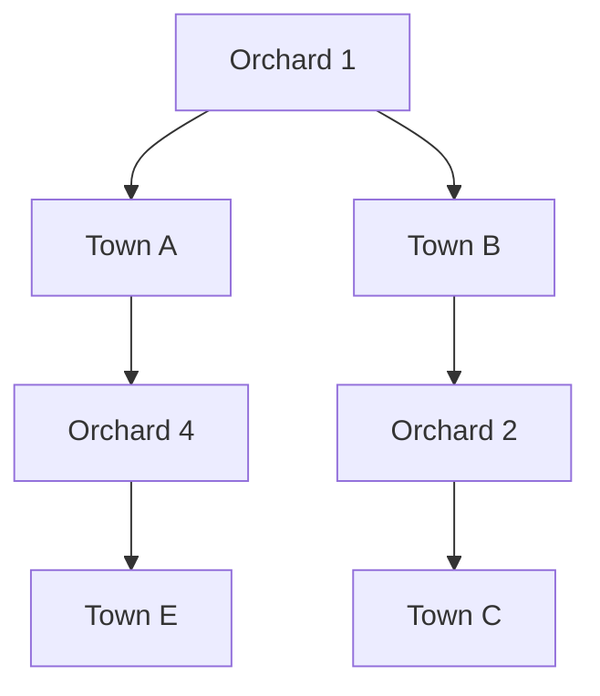
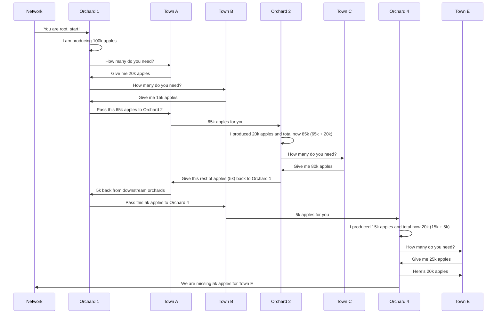

# Objectives

- Find schedule of open or close orchards to support nearby towns apple demands for 12 months period.
- No orchard can be depleted by ensuring that it will be close before it happen.
- Ensure that the system can found different routing if the usual orchard path is close.

# Codes

- This solution can be found in https://github.com/zakbar/spidey-apple
- Install node.js version 16
- Run `npm i` to get packages
- Run `npm test` to run tests

# Assumptions

- Every town will have its own apple consumption rate.
- All towns' consumption rate should always be maintained but can 30% less is allowable.

# Domain

There are 3 first class citizens in this implementation and they are Town, Orchard and Network.

## Town

- Town will consume apples harvested by orchards.
- It knows how many apple required in every month/period.

## Orchard

- Orchard responsible for producing apples.
- It has following attributes.
  - status of open or close.
  - rate of tree regeneration or degeneration dependant of status above.
  - number of tree to start with.
- it will also know how to calculate number of apples generated based of its tree.
- It will deliver its produce to multiple towns dependant on number of production.
- It also should know whether it should open or close before starting period cycle based on number of tree available vs degeneration rate configured.

## Orchard-Town Network

- In order to solve this problem, graph theory is chosen as first option and Orchard-Town Network is the heart of this solution. Orchard in this network can be considered as both node and edges, while town is a pure node.
- Network is where everything attached together, it connects orchard to town to another orchard and another town as following example.

- It also understand when orchard is open and close, hence it will choose which path that all related open orchard can use to deliver apples to towns.
- In order to know how many apples can be deliver to towns, max-flow algorith is used to see if we can deliver enough, too much or not enough produce. To simplify the explanation please see following sequence diagram.

- The example above is a very simplistic view of the orchard produced distribution and only cover single scenario and that's where we need to have Monte-Carlo style simulation to see different possibility to see if there is better way to get the output.

# Period Cycle Trigger

- Every month/period there will be a process of orchard-town network creation based on whether an orchard can open or not.
- Orchard will check its current number of available tree vs rate of degeneration and if the current cycle activity will not depleted, then it will be open.
- Once all open orchards known for this period, single or multiple orchard-town network can be created.
- For every network, following logic will be executed.

  1. Find the biggest network, which is one with most orchards and towns.
  2. Graph-search algorithm as explained in`Orchard-Town Network` chapter will be executed.
  3. Check if production met with all town apple demands and if not, make sure that other network will run through town with missing required apples.
  4. Remove other network that has towns covered by this network.
  5. Close orchards that doesn't need to deliver any apples and doesn't get through by others, so there will be more possible of open orchards in next periods.
  6. Go the next biggest network and make sure town status has been updated with above process.
  7. After running all network, make sure that there is town received less than 30% demands. If so, this set of networks are considered failed and one or more of the following might need to be done.
     - repeat with different starting orchard to distribute,
     - non-used-closed orchard might need to be open,
     - even reset the whole period set and start again differently.

- Once this set is run, another possible enhancement is to re-run but start with different criteria. Such as, instead of running the biggest network maybe check networks that have no or fewer overlaps. Using something like `linear programming`, we might be able to find better combination of open orchards and towns.
- Once all periods have been executed and we have a good schedule of when orchard will be open or closed, output like below will be generated.

  | Orchard | Period 1 | Period 2 | Period 3 | Period 4 | Period 5 | Period 6 |
  | ------- | -------- | -------- | -------- | -------- | -------- | -------- |
  | 1       | Open     | Open     | Close    | Open     | Open     | Close    |
  | 2       | Close    | Open     | Open     | Open     | Close    | Open     |
  | 3       | Open     | Close    | Open     | Open     | Open     | Close    |
  | 4       | Open     | Open     | Close    | Close    | Open     | Open     |
  | 5       | Close    | Open     | Open     | Open     | Close    | Open     |
  | 6       | Open     | Close    | Open     | Open     | Close    | Open     |

# Missing Requirement - Predictive Analysis

- Predictive analysis on town demand is something that is missing from this solution. If I can guess, there might be correlation between town consumption rate and population, which is something that is not part of this system.
- Possible solution around population prediction is a naive view of population increase/decrease within 12 months period and use it as correlation to town consumption rate as part of next year schedule creation.
